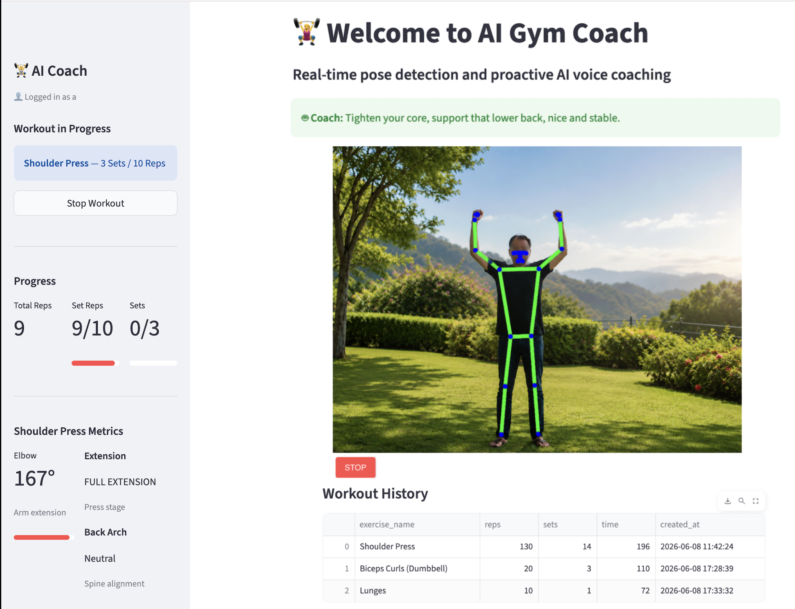

# AI Gym Coach App

A Streamlit-based workout assistant that combines live pose detection, a workout planner, session logging, and optional AI voice coaching.

## Screenshot



## Features

- User login and session persistence via SQLite
- Workout planning with selectable exercise, sets, and reps
- Real-time camera analysis using `streamlit-webrtc`
- Exercise metrics and form monitoring for:
  - `Squats`
  - `Shoulder Press`
  - `Push-ups`
  - `Biceps Curls (Dumbbell)`
  - `Lunges`
- Live exercise history stored per user
- Optional voice coaching using the GROQ API

## Setup

1. Create and activate the virtual environment:
   ```bash
   python -m venv .venv
   source .venv/bin/activate
   ```
2. Install dependencies:
   ```bash
   pip install -r requirements.txt
   ```
3. Configure secrets (optional):
   - Create `.streamlit/secrets.toml`
   - Add the GROQ API key if you want AI voice coaching

   ```toml
   GROQ_API_KEY = "your_groq_api_key_here"
   ```

4. Run the app:
   ```bash
   streamlit run app.py
   ```

## Usage

1. Open the app in your browser.
2. Log in with a username and password.
3. Choose your exercise, target sets, and reps from the sidebar.
4. Start the workout to activate the camera and begin real-time analysis.
5. The app logs completed exercise sessions and shows them under `Workout History`.

## Project structure

- `app.py` — Streamlit entrypoint and app orchestration
- `components/` — sidebar and main UI rendering
- `services/` — business logic, persistence, tracking, and coaching
- `vision/` — exercise video processing and pose analysis
- `data/` — data loading and database helpers
- `tests/` — automated test examples

## Notes

- The app stores workout data in `data/gym_coach.db`.
- If no GROQ key is configured, voice coaching remains disabled and the app still runs.
- Add a screenshot under `docs/` or `.streamlit/` and update this README if you want a visual preview.
